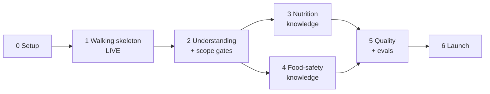

# Implementation Plan — AI-Powered Food, Nutrition & Food Safety Chatbot

> A step-by-step plan for building the system in [architecture.md](architecture.md), which addresses the requirements in [problemStatement.md](problemStatement.md).
> Section references such as "§6.2" point to architecture.md. Rule IDs **R1–R10** and goal IDs **G1–G6** are defined in architecture.md §1.

---

## Overview

| Phase | Name | Outcome | Est. effort* |
|-------|------|---------|--------------|
| 0 | Project setup | Repo, accounts, keys, tooling ready | 0.5 day |
| 1 | Walking skeleton (live) | Public URL: chat UI (message list, input box, empty sources panel) → FastAPI → one Groq call → `{answer, claims}`; conversations and failures stored | 2–3 days |
| 2 | Question understanding + scope gates | Classification, clarification, and scope enforced in code; all response types | 2–3 days |
| 3 | Nutrition knowledge (India-first) | IFCT data, Hindi/regional names, household measures, grounded nutrient answers | 3–4 days |
| 4 | Food-safety knowledge + retrieval | FSSAI-first safety rules, hot-climate rules, pgvector retrieval | 3 days |
| 5 | Quality, evals and hardening | Eval suite, admin failures view, rate limits, logging, polish | 2–3 days |
| 6 | Launch and handover | Final checks against every rule, README, demo | 1 day |
| — | Later | Hindi answers, image input, dietary profiles, voice | — |

\*Estimates assume one developer using Cursor for scaffolding.

**Guiding principle:** deploy in Phase 1 and ship every later phase to the live URL. Rules R1–R10 are satisfied from Phase 1 onward and must never regress.

Phases 3 and 4 both depend on Phase 2 and can run in parallel if two people are available.

---

## Phase 0 — Project Setup

> **Status (2026-09-28):** repository, tooling, pre-commit and CI done. Accounts and keys are still to be created by the project owner.

**Goal:** everything needed to start coding is in place.

### Tasks

**Accounts and keys**
- [ ] Create a Groq account and generate `GROQ_API_KEY`.
- [ ] Create a Supabase project in the **Mumbai (`ap-south-1`)** region and note `DATABASE_URL`.
- [ ] Create a Railway project (backend) and a Vercel project (frontend), both linked to the Git repo.
- [ ] Confirm that `openai/gpt-oss-20b` and `openai/gpt-oss-120b` are available on the Groq account.

**Repository**
- [x] Initialise a Git repo with the `backend/` and `frontend/` layout from §14.
- [x] Add `.gitignore` (Python, Node, `.env`, `backend/data/raw/`).
- [x] Add `.env.example` from §13.
- [x] Move `problemStatement.md` and `architecture.md` into the repo root.

**Tooling**
- [x] Backend: Python 3.12, `uv` or `poetry`, and `ruff` + `mypy` configured in `pyproject.toml`.
- [x] Frontend: `create-next-app` (TypeScript, App Router, Tailwind), ESLint, Prettier, Vitest.
- [x] Pre-commit hooks for ruff and prettier.
- [x] CI (GitHub Actions): lint + unit tests for both apps on every push.

### Exit criteria
- `backend` and `frontend` both build locally.
- CI runs green on an empty test suite.
- All secrets live in local `.env` files and platform dashboards, never in Git.

---

## Phase 1 — Walking Skeleton (Live)

**Goal:** a thin but complete path through the whole system, deployed to a public URL, that already satisfies every hard rule.

**Rules satisfied:** R1, R2, R3, R4, R6, R7, R8, R9, R10.

### 1.1 Database

- [ ] Write `backend/migrations/001_core.sql` with `conversations`, `messages` and `failures` (§8.2, §8.3).
- [ ] Apply it to Supabase.
- [ ] `app/db.py`: async connection pool (`asyncpg`), with the connection string from `config.py`.

### 1.2 Schemas

- [ ] `app/schemas/answer.py`: `Claim`, `LLMAnswer`, `ChatResponse` exactly as in §6.2.
  - `Claim.source: None`, and every model uses `extra="forbid"`.
- [ ] `app/llm/strict_schema.py`: `to_groq_strict(model)` produces JSON Schema with:
  - `additionalProperties: false` on every object
  - every property listed in `required`
  - `source` typed as `{"type": "null"}`
- [ ] Unit tests:
  - the generated `LLMAnswer` schema equals the JSON in §6.2
  - `Claim(text="x", source="abc")` fails validation

### 1.3 LLM client

- [ ] `app/llm/client.py`: `AsyncGroq(max_retries=0, timeout=30)`, plus a `structured_call()` using `response_format: json_schema, strict: true` (§5.6).
- [ ] Model IDs come from env (`MODEL_ANSWER`). No other module imports `groq`.
- [ ] Catch `RateLimitError`, `APIStatusError`, `APIConnectionError` and `APITimeoutError`, and raise a typed internal `LLMCallError(kind=...)`.

### 1.4 Failure recording

- [ ] `app/failures.py`: `record_failure(request_id, conversation_id, stage, failure_type, severity, model, prompt_version, user_message, raw_output, error_detail, latency_ms)`.
- [ ] It must never raise. If the database write itself fails, it logs to stderr with the full payload.

### 1.5 Validation

- [ ] `app/pipeline/validate.py`:
  - parse with `LLMAnswer.model_validate_json(raw)` (no repair)
  - hard invariants: `source_not_null`, `empty_answer`, `empty_claims`, `length_exceeded` (§6.4)
  - final `ChatResponse.model_validate`
- [ ] Any failure → `record_failure(...)` → an `error` `ChatResponse`.

### 1.6 Response builders

- [ ] `app/responses.py`: `build_answer_response`, `build_error_response`. Both return validated `ChatResponse` objects, with the `notices` disclaimer added by code.

### 1.7 Conversation store

- [ ] `app/store/conversations.py`: `upsert_conversation`, `add_message`, `load_recent(conversation_id, n)`, `load_all`, `delete`.

### 1.8 API

- [ ] `POST /api/chat`:
  1. Generate a `request_id`.
  2. Upsert the conversation.
  3. Store the user message.
  4. Call Groq with a minimal answer prompt (a first draft of §9.1).
  5. Validate.
  6. Store the assistant `ChatResponse`.
  7. Return it.
- [ ] `GET /api/conversations/{id}`, `DELETE /api/conversations/{id}`.
- [ ] `GET /api/schema` (the `ChatResponse` JSON Schema) and `GET /api/health`.
- [ ] CORS limited to `ALLOWED_ORIGINS`.
- [ ] `app/prompts/answer.md` with `PROMPT_VERSION = "answer-v0.1"`.

### 1.9 Frontend

- [ ] `lib/types.ts` generated from `/api/schema` (`json-schema-to-typescript`, added as an npm script).
- [ ] `lib/api.ts`: `sendMessage()`, `getConversation()`, `deleteConversation()`.
- [ ] `app/page.tsx`: two-column layout, with `ChatPanel` on the left and `SourcesPanel` on the right (stacked on mobile).
- [ ] Components:
  - `MessageList`
  - `MessageBubble` (answer as Markdown, then claims as bullets)
  - `ChatInput` (Enter sends, Shift+Enter adds a new line, disabled while sending, 1,000-character limit)
  - `SourcesPanel` (**no props**, always shows "No sources to show.")
  - `SuggestedPrompts` (the 5 problem-statement examples)
- [ ] `conversation_id` stored in `localStorage`; reload fetches history; "New chat" button.
- [ ] "Thinking…" indicator, error bubble showing the `request_id`, and the disclaimer footer.

### 1.10 Deployment

- [x] `backend/Dockerfile` (uvicorn) — added in Phase 0. Deploy to Railway with env vars from §13.
- [ ] Frontend deployed to Vercel with `NEXT_PUBLIC_API_URL`.
- [ ] Set `ALLOWED_ORIGINS` to the Vercel production domain.

### Tests
- Unit: schema export, validation invariants, response builders (each returns a valid `ChatResponse`).
- Integration (stubbed Groq client):
  - happy path → 1 conversation row + 2 message rows
  - invalid JSON → `failures` row + `error` response
  - `source: "x"` → `failures` row (`source_not_null`)
  - timeout → `failures` row (`timeout`)
- Frontend: `SourcesPanel` renders its empty state before and after messages; `MessageBubble` renders answer + claims.

### Exit criteria (Definition of Done)
- [ ] The public Vercel URL answers "Is brown rice healthier than white rice?" with an answer and a claims list.
- [ ] The response JSON parses against `/api/schema`, and every `source` is `null`.
- [ ] The sources panel is visible next to the conversation and empty.
- [ ] Refreshing the page restores the conversation from the database.
- [ ] Setting `MODEL_ANSWER` to an invalid model on a staging deploy produces a `failures` row and an `error` bubble. Nothing is silently retried.
- [ ] `GROQ_API_KEY` appears only in Railway's environment. Searching the frontend bundle for "groq" finds nothing.

---

## Phase 2 — Question Understanding + Scope Gates

**Goal:** the system understands what is being asked, asks for clarification when needed, and enforces scope in code.

**Rules satisfied:** R5 (new). R1–R4 and R7 are extended to the new model call.
**Goals:** G2, G4, G5.

### 2.1 Understanding call

- [ ] `app/schemas/analysis.py`: `QuestionAnalysis` and its nested models (§5.3), all fields required, `extra="forbid"`.
- [ ] `app/prompts/understanding.md` (§9.2):
  - category definitions with the 5 problem-statement examples and Hinglish variants
  - clarification rules
  - normalization of Indian food names
  - `risk_flags`
- [ ] `app/pipeline/understanding.py`: calls Groq with `MODEL_UNDERSTANDING` (`openai/gpt-oss-20b`), includes the last 6 turns, validates, and records failures (stage `understanding`).
- [ ] Store `analysis` on the user's message row.

### 2.2 Scope gates (`app/scope/`)

- [ ] `blocked_topics.py`: keyword/regex lists for:
  - medication or supplement dosing
  - diagnosis requests
  - weight-loss drugs
  - eating-disorder behaviours
  - alcohol or drug advice
- [ ] `input_gate.py` (§7, Gate 1):
  - length check (2–1,000 characters)
  - blocked topics → code-written referral response + a `scope_block` row
  - emergency keywords → flag for a 112/108 notice
  - injection patterns → `injection_suspected` row; the request continues
- [ ] `classification_gate.py` (Gate 2):
  - `out_of_scope` → code response
  - unknown category → failure
  - `needs_clarification` → clarification response
  - `medication` risk flag → referral response
- [ ] `output_gate.py` (Gate 3):
  - runs the invariants
  - sets `category` from the analysis, not the model
  - adds `notices` (disclaimer, emergency, high-risk group)

### 2.3 Orchestrator

- [ ] `app/pipeline/orchestrator.py`: input gate → understanding → classification gate → prompt builder → answer call → validation → output gate (the lifecycle in §4).
- [ ] `app/pipeline/prompt_builder.py`: system prompt + recent turns + `<question_analysis>` and `<user_question>` blocks (the `<context>` block stays empty until Phases 3–4).
- [ ] `app/responses.py`: add `build_clarification_response`, `build_out_of_scope_response`, `build_referral_response`.

### 2.4 Answer prompt

- [ ] Update `answer.md` to the full §9.1 draft (India context, food-safety verdict first, conservative wording, `source` always null). Bump to `answer-v0.2`.

### 2.5 Frontend

- [ ] `CategoryBadge`: Nutrition / Food Safety / General Food / Needs more detail / Out of scope / Error.
- [ ] Render `notices` below the answer (highlighted for emergency notices).

### Tests
- Unit: every gate, with a table of at least 40 inputs (allowed, blocked, emergency, injection, too long, empty).
- Unit: each code-built response passes `ChatResponse` validation.
- Integration (stubbed Groq): the out-of-scope and clarification paths make **no** answer call; a blocked topic makes **no** Groq call at all.
- Manual: the 5 problem-statement examples on the live URL.

### Exit criteria
- [ ] The 5 problem-statement examples are classified correctly (nutrition / food safety).
- [ ] "Is it safe to eat?" → `answer_type=clarification`.
- [ ] "What dose of metformin should I take?" is blocked by the **input gate**, which the logs show, with no Groq call.
- [ ] "Write a poem about cars" → `out_of_scope`.
- [ ] Every response type (answer, clarification, out_of_scope, error) parses against the schema.
- [ ] A Hinglish question ("kya raat ka chawal kha sakte hai?") is understood as a food-safety question.

---

## Phase 3 — Nutrition Knowledge (India-first)

**Goal:** nutrient answers are grounded in IFCT data, with USDA as a fallback, and support Indian food names and household measures.

**Goal addressed:** G3.

### 3.1 Data acquisition

- [ ] Get IFCT 2017 tables (ICMR-NIN) and confirm their license and reuse terms.
- [ ] Download USDA FoodData Central (Foundation Foods + SR Legacy) CSVs.
- [ ] Write `backend/data/portions.yaml`: katori, cup, glass, tbsp, tsp, roti, idli, dosa, handful → grams (generic + food-specific).
- [ ] Write `backend/data/synonyms.yaml`: English + Hindi + regional names (dahi, chawal, baingan, bhindi, arhar/toor, rajma, atta, palak, methi, ragi, bajra, jowar…).

### 3.2 Schema and ingestion

- [ ] `migrations/002_knowledge.sql`: `foods`, `food_synonyms`, `nutrients`, `portion_weights` (§10.2).
- [ ] Ingestion scripts (idempotent, each run tagged with a `dataset_version`):
  - `scripts/ingest/load_ifct.py`
  - `scripts/ingest/load_usda.py` (only foods missing from IFCT, or tagged as fallback)
  - `scripts/ingest/load_portions.py`
  - `scripts/ingest/build_synonyms.py`
- [ ] Standardize nutrient names across both datasets (`protein`, `iron`, `energy_kcal`, …).

### 3.3 Knowledge modules

- [ ] `knowledge/entity_resolver.py`: exact synonym match → `rapidfuzz` fallback (threshold ~85) → IFCT preferred over USDA → `unresolved_entities`.
- [ ] `knowledge/units.py`: household measure → grams; metric conversions.
- [ ] `knowledge/nutrition.py`:
  - per-100 g lookup
  - scaling to the user's quantity
  - comparison facts (e.g. brown vs. white rice)
  - recommendation query (top 10 by nutrient, vegetarian by default)
  - adds a USDA-fallback assumption when USDA data is used
- [ ] `schemas/context.py`: `Fact`, `Passage`, `ContextBundle` (§5.4).

### 3.4 Pipeline integration

- [ ] The orchestrator calls the knowledge layer for `nutrition`, `general_food` and `mixed` categories.
- [ ] The prompt builder fills the `<context>` block with facts `F1..Fn` and assumptions.
- [ ] Store `context_snapshot` on the assistant message row.
- [ ] Add the soft check `unverified_number`: numbers in claims that aren't in the context facts → `warning` row. The response is returned unchanged.
- [ ] Bump the prompt to `answer-v0.3`.

### Tests
- Unit: synonym resolution (at least 30 Indian names), unit conversion, scaling maths, recommendation query filtering.
- Integration: "protein in 100 g paneer" → the context contains the IFCT paneer fact.
- Integration: an unknown food → `unresolved_entities` is filled and the answer says the data couldn't be verified.

### Exit criteria
- [ ] "How much protein is there in 100g of paneer?" → the number in the claim matches IFCT.
- [ ] "Calories in 2 rotis" and "iron in 1 katori palak" use the correct household-measure conversions.
- [ ] "What foods are high in iron?" returns Indian vegetarian foods by default.
- [ ] "Is brown rice healthier than white rice?" uses comparison facts from the database.
- [ ] `unverified_number` warnings appear in fewer than 10% of nutrition answers in a 30-question manual run.
- [ ] The sources panel is still empty, and every `source` is still `null` (dataset names stay in `context_snapshot` only).

---

## Phase 4 — Food-Safety Knowledge + Retrieval

**Goal:** food-safety answers are grounded in FSSAI-first rules, adjusted for Indian conditions, with semantic retrieval over guidance documents.

**Goals addressed:** G3, G4.

### 4.1 Safety rules

- [ ] Write `backend/data/safety_rules.yaml`: FSSAI first, with WHO and USDA FSIS used only for numbers FSSAI doesn't publish. Cover at least:
  - cooked rice, cooked dal and curries, milk and dairy, paneer, curd
  - raw and cooked chicken, fish, eggs
  - cut fruit, street-food chutneys
  - thawed meat, leftovers in general
- [ ] Each rule has `max_duration_hours`, `location`, `state`, `safe_internal_temp_c` where relevant, and a `region_note` (heat above 32 °C → 1-hour limit; power-cut guidance for fridges).
- [ ] `migrations/003_safety.sql`: `safety_rules`, `doc_chunks` + `CREATE EXTENSION vector` + HNSW index (§10.2).
- [ ] `scripts/ingest/load_safety_rules.py`.

### 4.2 Retrieval

- [ ] Collect guidance documents: FSSAI consumer handbooks / Eat Right India pages, WHO "Five Keys to Safer Food", ICMR-NIN Dietary Guidelines 2024. Check licenses.
- [ ] `scripts/ingest/chunk_and_embed.py`: ~500-token chunks with 50-token overlap, embedded with `fastembed` (`BAAI/bge-small-en-v1.5`, 384 dimensions), stored in `doc_chunks` with a `category`.
- [ ] `knowledge/retriever.py`: embed `intent_summary + foods`, run a pgvector cosine search filtered by category, keep the top 4.
- [ ] Load the embedding model once at startup; `/api/health` reports it as ready.
- [ ] Dockerfile downloads the fastembed model at build time.

### 4.3 Pipeline integration

- [ ] `knowledge/safety.py`: rule lookup by `(food_group, state, location)` from the analysis's storage context.
- [ ] The orchestrator calls the safety lookup + retriever for `food_safety` and `mixed`, and the retriever for nutrition as well.
- [ ] Output gate: emergency notice (112/108) when `risk_flags` contains `symptoms`; high-risk-group notice.
- [ ] Soft check `unsupported_without_context` (§6.4).
- [ ] Bump the prompt to `answer-v0.4`.

### Tests
- Unit: rule lookup matching, including partial matches (state unknown).
- Integration: the retriever returns food-safety chunks for "chicken in the fridge".
- Manual: all food-safety examples below on the live URL.

### Exit criteria
- [ ] "Can I eat cooked rice that was left outside overnight?" → the answer starts with a clear verdict ("Not recommended…") and mentions the hot-climate rule.
- [ ] "How long can chicken be stored in the refrigerator?" → a specific limit taken from `safety_rules`.
- [ ] "Milk was out during a power cut for 4 hours" → a conservative discard recommendation.
- [ ] A question mentioning symptoms ("vomiting after eating biryani") → emergency notice in `notices`.
- [ ] Mixed questions ("Is paneer healthy and how long does it last in the fridge?") cover both parts clearly.
- [ ] The sources panel is still empty; every `source` is still `null`.

---

## Phase 5 — Quality, Evals and Hardening

**Goal:** measurable quality, visibility into failures, and production hardening.

**Rules strengthened:** R2, R4, R5, R7.

### 5.1 Eval suite

- [ ] `backend/tests/evals/cases.yaml`: 100–150 labelled questions across the slices in §12 (classification, nutrition accuracy, food safety, clarification, scope, schema, Indian context).
- [ ] `backend/tests/evals/run_evals.py` runs against the real Groq models and uses deterministic checks:
  - category
  - `answer_type`
  - numbers within ±5% of IFCT
  - verdict phrase at the start of `answer`
  - blocked in code (no Groq call)
  - 100% schema parse
  - 100% `source == null`
- [ ] Optional LLM-as-judge rubric (clarity, relevance, no unsupported claims) using `openai/gpt-oss-120b` with its own strict schema.
- [ ] Results are saved to `tests/evals/results/{date}_{PROMPT_VERSION}.json`, with a summary table printed.
- [ ] A GitHub Action runs the evals manually or when files in `prompts/`, `schemas/` or `scope/` change.

### 5.2 Failure visibility

- [ ] `GET /api/admin/failures` (requires the `ADMIN_TOKEN` header) with filters by `failure_type`, `stage` and date.
- [ ] Saved SQL queries in Supabase: failures per day by type; top recurring `failure_type`; warning rate per prompt version.
- [ ] Weekly review routine: every recurring failure type becomes an issue, gets fixed at the root (prompt, schema or code), and gets an eval case added. **Never** hidden with retries or post-processing.

### 5.3 Hardening

- [ ] Rate limiting with `slowapi` (20 requests/min per IP) → HTTP 429, which the UI shows as "Too many requests".
- [ ] Structured JSON logging with `request_id`, `conversation_id`, category, latency per stage, and token usage.
- [ ] Timeouts: Groq 30 s; database queries 5 s. Each is recorded as a failure when hit.
- [ ] Input sanitization: strip control characters and cap message length on the server as well as the client.
- [ ] Load test: 20 concurrent users with `locust` against staging; check p95 latency and that no failures are unrecorded.

### 5.4 Frontend polish

- [ ] Mobile layout: the sources panel stacks below the chat and stays empty.
- [ ] Accessibility: focus states, `aria-live` on new messages, keyboard-only use.
- [ ] Empty state, loading state, error state and rate-limit state all designed.

### Exit criteria
- [ ] Baseline eval results are recorded for the current `PROMPT_VERSION`:
  - schema parse rate = **100%**
  - `source == null` = **100%**
  - scope blocks happen in code = **100%**
  - classification ≥ 90%
  - nutrition numeric accuracy ≥ 90%
  - food-safety verdict correctness ≥ 95%
- [ ] Admin failures endpoint works, and the Supabase queries are saved.
- [ ] Load test passes with p95 < 6 s, and every error has a `failures` row.

---

## Phase 6 — Launch and Handover

**Goal:** confirm every requirement on the live system and document it.

### Tasks
- [ ] Run the **requirements checklist** below against the production URL.
- [ ] `README.md`: what the app does, the live URL, architecture summary (link to architecture.md), local setup, env vars, how to run the ingestion scripts, tests and evals, how to review failures.
- [ ] Record a short demo covering:
  - the 5 problem-statement examples
  - a clarification
  - an out-of-scope request
  - a blocked topic
  - the empty sources panel
  - a failure appearing in the `failures` table
- [ ] Tag release `v1.0.0`.

### Requirements checklist (production)

| # | Check | How to verify |
|---|-------|---------------|
| R1 | Structured outputs are used, with no prose parsing | Code review: `client.py` always sends `response_format` with `strict: true`; `json.loads` or regex over prose appears nowhere |
| R2 | Every response parses | Evals show 100% parse; `/api/schema` validates a sample of stored `messages.content` |
| R3 | Answer text + claims list, each claim with claim text and source | Inspect any `/api/chat` response |
| R4 | `source` is always `null` | SQL: `SELECT count(*) FROM messages, jsonb_array_elements(content->'claims') c WHERE c->'source' <> 'null'::jsonb` returns 0 |
| R5 | Scope limits enforced in code | Blocked-topic request → no Groq call in the logs; unit tests for the gates |
| R6 | Live at a public URL | Open the Vercel URL in a private window |
| R7 | Failures recorded, not patched | A forced failure → `failures` row + `error` response; `max_retries=0`; no JSON repair code |
| R8 | Model calls behind the backend | Search the frontend bundle for "groq" (no results); only Railway holds `GROQ_API_KEY` |
| R9 | Message list, input box, sources panel (empty) | Visual check on desktop and mobile; Vitest test |
| R10 | Chat endpoint, conversation storage, model call | `POST /api/chat` works; rows in `conversations` and `messages`; reload restores history |
| G1–G6 | Problem-statement behaviour | The 5 example questions answered correctly and clearly; nutrition vs. safety clearly separated; uncertainty stated when data is missing |

### Exit criteria
- [ ] Every row in the checklist passes on production.
- [ ] README and demo are complete; release is tagged.

---

## Later (post-v1)

| Item | Notes |
|------|-------|
| Hindi and regional-language answers | Add a `language` field to the analysis; translate the prompt; add eval slices per language |
| Image input | Food photo or FSSAI label → requires a vision-capable model with structured outputs |
| Dietary profiles | Save vegetarian/Jain/diabetic preferences per conversation or user |
| Voice | Speech-to-text on input (Groq hosts Whisper models) |
| Response caching | Cache `QuestionAnalysis` + `ContextBundle` for repeated normalized questions |

---

## Cross-Phase Practices

### Branching and releases
- `main` is always deployable; feature branches go through PRs with CI (lint, unit, integration).
- Vercel preview deployments for every PR; a Railway staging environment for the backend.
- Every prompt change bumps `PROMPT_VERSION` and is noted in the PR description, along with eval results from Phase 5 onward.

### Definition of Done (every task)
- Code is typed (mypy / TypeScript strict) and linted.
- Tests are added or updated, and CI is green.
- No new code path can return a response that skips `ChatResponse` validation.
- No new code path can swallow an error without calling `record_failure`.
- The change is deployed to staging and smoke-tested.

### Risk register

| Risk | Impact | Mitigation | Phase |
|------|--------|------------|-------|
| Groq rejects a strict schema (unsupported keyword) | Model calls fail | `to_groq_strict()` + a startup self-test per schema; keep schemas simple | 1 |
| Groq model deprecated or renamed | Outage | Model IDs in env vars; the failure is recorded, visible, and fixed by config | 1 |
| IFCT data hard to obtain or licensing unclear | Weaker Indian nutrition coverage | Start with USDA + a curated set of ~100 common Indian foods; mark assumptions | 3 |
| FSSAI doesn't publish specific storage durations | Gaps in safety rules | Use WHO/USDA numbers with a `region_note` adjusting for Indian heat | 4 |
| Model invents numbers | Wrong nutrition info | Numbers come from the database; `unverified_number` warnings; eval accuracy checks | 3, 5 |
| Unsafe food-safety advice | User harm | Conservative prompt, curated rules, verdict checks in evals, emergency notices from code | 4, 5 |
| Groq rate limits on the free tier | Errors under load | Rate limiting per IP, recorded `rate_limited` failures, upgrade tier if needed | 5 |
| fastembed increases the container size or cold start | Slow deploys | Small model (bge-small); download at build time; health check waits for model load | 4 |

### Open decisions (from architecture §16)
1. Confirm Groq is acceptable, since the brief lists Anthropic or OpenAI. It affects only `app/llm/`.
2. When to add Hindi answers.
3. Whether the Supabase dashboard is enough for failure review, or an in-app admin page is needed.
4. IFCT 2017 and FSSAI data licensing, which must be settled before Phase 3/4 ingestion.
