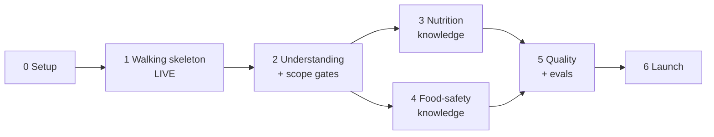

# Implementation Plan — AI-Powered Food, Nutrition & Food Safety Chatbot

> A step-by-step plan for building the system in [architecture.md](architecture.md), which addresses the requirements in [problemStatement.md](problemStatement.md).
> Section references such as "§6.2" point to architecture.md. Rule IDs **R1–R10** and goal IDs **G1–G6** are defined in architecture.md §1.

---

## Overview

| Phase | Name | Outcome | Est. effort* |
|-------|------|---------|--------------|
| 0 | Project setup | Repo, accounts, keys, tooling ready | 0.5 day |
| 1 | Walking skeleton (live) | Public URL: chat UI (message list, input box, empty sources panel) → FastAPI → one Groq call → `{answer, claims}`; conversations and failures stored | 2–3 days |
| 2 | Question understanding + scope gates | Classification, clarification, and scope enforced in code; all response types | 2–3 days |
| 3 | Nutrition knowledge (India-first) | IFCT data, Hindi/regional names, household measures, grounded nutrient answers | 3–4 days |
| 4 | Food-safety knowledge + retrieval | FSSAI-first safety rules, hot-climate rules, pgvector retrieval | 3 days |
| 5 | Quality, evals and hardening | Eval suite, admin failures view, rate limits, logging, polish | 2–3 days |
| 6 | Launch and handover | Final checks against every rule, README, demo | 1 day |
| — | Later | Hindi answers, image input, dietary profiles, voice | — |

\*Estimates assume one developer using Cursor for scaffolding.

**Guiding principle:** deploy in Phase 1 and ship every later phase to the live URL. Rules R1–R10 are satisfied from Phase 1 onward and must never regress.

Phases 3 and 4 both depend on Phase 2 and can run in parallel if two people are available.

---

## Phase 0 — Project Setup

> **Status (2026-09-28):** repository, tooling, pre-commit and CI done. Accounts and keys are still to be created by the project owner.

**Goal:** everything needed to start coding is in place.

### Tasks

**Accounts and keys**
- [ ] Create a Groq account and generate `GROQ_API_KEY`.
- [ ] Create a Supabase project in the **Mumbai (`ap-south-1`)** region and note `DATABASE_URL`.
- [ ] Create a Railway project (backend) and a Vercel project (frontend), both linked to the Git repo.
- [ ] Confirm that `openai/gpt-oss-20b` and `openai/gpt-oss-120b` are available on the Groq account.

**Repository**
- [x] Initialise a Git repo with the `backend/` and `frontend/` layout from §14.
- [x] Add `.gitignore` (Python, Node, `.env`, `backend/data/raw/`).
- [x] Add `.env.example` from §13.
- [x] Move `problemStatement.md` and `architecture.md` into the repo root.

**Tooling**
- [x] Backend: Python 3.12, `uv` or `poetry`, and `ruff` + `mypy` configured in `pyproject.toml`.
- [x] Frontend: `create-next-app` (TypeScript, App Router, Tailwind), ESLint, Prettier, Vitest.
- [x] Pre-commit hooks for ruff and prettier.
- [x] CI (GitHub Actions): lint + unit tests for both apps on every push.

### Exit criteria
- `backend` and `frontend` both build locally.
- CI runs green on an empty test suite.
- All secrets live in local `.env` files and platform dashboards, never in Git.

---

## Phase 1 — Walking Skeleton (Live)

> **Status (2026-09-30):** code, tests and CI done; migration applied to Supabase; deployed. Frontend: https://health-nutrition-app-nine.vercel.app · Backend: https://health-nutrition-app-production-6937.up.railway.app. Verified live via the API (answer + claims, all `source` null, history reload, CORS, no "groq" in the bundle). The invalid-model failure was verified locally; there is no separate staging deploy yet.

**Goal:** a thin but complete path through the whole system, deployed to a public URL, that already satisfies every hard rule.

**Rules satisfied:** R1, R2, R3, R4, R6, R7, R8, R9, R10.

### 1.1 Database

- [x] Write `backend/migrations/001_core.sql` with `conversations`, `messages` and `failures` (§8.2, §8.3).
- [x] Apply it to Supabase.
- [x] `app/db.py`: async connection pool (`asyncpg`), with the connection string from `config.py`.

### 1.2 Schemas

- [x] `app/schemas/answer.py`: `Claim`, `LLMAnswer`, `ChatResponse` exactly as in §6.2.
  - `Claim.source: None`, and every model uses `extra="forbid"`.
- [x] `app/llm/strict_schema.py`: `to_groq_strict(model)` produces JSON Schema with:
  - `additionalProperties: false` on every object
  - every property listed in `required`
  - `source` typed as `{"type": "null"}`
- [x] Unit tests:
  - the generated `LLMAnswer` schema equals the JSON in §6.2
  - `Claim(text="x", source="abc")` fails validation

### 1.3 LLM client

- [x] `app/llm/client.py`: `AsyncGroq(max_retries=0, timeout=30)`, plus a `structured_call()` using `response_format: json_schema, strict: true` (§5.6).
- [x] Model IDs come from env (`MODEL_ANSWER`). No other module imports `groq`.
- [x] Catch `RateLimitError`, `APIStatusError`, `APIConnectionError` and `APITimeoutError`, and raise a typed internal `LLMCallError(kind=...)`.

### 1.4 Failure recording

- [x] `app/failures.py`: `record_failure(request_id, conversation_id, stage, failure_type, severity, model, prompt_version, user_message, raw_output, error_detail, latency_ms)`.
- [x] It must never raise. If the database write itself fails, it logs to stderr with the full payload.

### 1.5 Validation

- [x] `app/pipeline/validate.py`:
  - parse with `LLMAnswer.model_validate_json(raw)` (no repair)
  - hard invariants: `source_not_null`, `empty_answer`, `empty_claims`, `length_exceeded` (§6.4)
  - final `ChatResponse.model_validate`
- [x] Any failure → `record_failure(...)` → an `error` `ChatResponse`.

### 1.6 Response builders

- [x] `app/responses.py`: `build_answer_response`, `build_error_response`. Both return validated `ChatResponse` objects, with the `notices` disclaimer added by code.

### 1.7 Conversation store

- [x] `app/store/conversations.py`: `upsert_conversation`, `add_message`, `load_recent(conversation_id, n)`, `load_all`, `delete`.

### 1.8 API

- [x] `POST /api/chat`:
  1. Generate a `request_id`.
  2. Upsert the conversation.
  3. Store the user message.
  4. Call Groq with a minimal answer prompt (a first draft of §9.1).
  5. Validate.
  6. Store the assistant `ChatResponse`.
  7. Return it.
- [x] `GET /api/conversations/{id}`, `DELETE /api/conversations/{id}`.
- [x] `GET /api/schema` (the `ChatResponse` JSON Schema) and `GET /api/health`.
- [x] CORS limited to `ALLOWED_ORIGINS`.
- [x] `app/prompts/answer.md` with `PROMPT_VERSION = "answer-v0.1"`.

### 1.9 Frontend

- [x] `lib/types.ts` generated from `/api/schema` (`json-schema-to-typescript`, added as an npm script).
- [x] `lib/api.ts`: `sendMessage()`, `getConversation()`, `deleteConversation()`.
- [x] `app/page.tsx`: two-column layout, with `ChatPanel` on the left and `SourcesPanel` on the right (stacked on mobile).
- [x] Components:
  - `MessageList`
  - `MessageBubble` (answer as Markdown, then claims as bullets)
  - `ChatInput` (Enter sends, Shift+Enter adds a new line, disabled while sending, 1,000-character limit)
  - `SourcesPanel` (**no props**, always shows "No sources to show.")
  - `SuggestedPrompts` (the 5 problem-statement examples)
- [x] `conversation_id` stored in `localStorage`; reload fetches history; "New chat" button.
- [x] "Thinking…" indicator, error bubble showing the `request_id`, and the disclaimer footer.

### 1.10 Deployment

- [x] `backend/Dockerfile` (uvicorn) — added in Phase 0. Deployed to Railway with env vars from §13 (`railway.toml`).
- [x] Frontend deployed to Vercel with `NEXT_PUBLIC_API_URL`.
- [x] Set `ALLOWED_ORIGINS` to the Vercel production domain.

### Tests
- Unit: schema export, validation invariants, response builders (each returns a valid `ChatResponse`).
- Integration (stubbed Groq client):
  - happy path → 1 conversation row + 2 message rows
  - invalid JSON → `failures` row + `error` response
  - `source: "x"` → `failures` row (`source_not_null`)
  - timeout → `failures` row (`timeout`)
- Frontend: `SourcesPanel` renders its empty state before and after messages; `MessageBubble` renders answer + claims.

### Exit criteria (Definition of Done)
- [ ] The public Vercel URL answers "Is brown rice healthier than white rice?" with an answer and a claims list.
- [x] The response JSON parses against `/api/schema`, and every `source` is `null`.
- [ ] The sources panel is visible next to the conversation and empty.
- [ ] Refreshing the page restores the conversation from the database.
- [ ] Setting `MODEL_ANSWER` to an invalid model on a staging deploy produces a `failures` row and an `error` bubble. Nothing is silently retried.
- [x] `GROQ_API_KEY` appears only in Railway's environment. Searching the frontend bundle for "groq" finds nothing.

---

## Phase 2 — Question Understanding + Scope Gates

> **Status (2026-09-30):** code and tests done (186 backend, 30 frontend). The exit criteria were verified locally against the real Groq models, not yet on the live URL. Prompts: `answer-v0.2.1` + `understanding-v0.1`. Notes:
> - The classification gate checks the `medication` risk flag **before** `needs_clarification`, so a medicine question gets a referral instead of a follow-up question.
> - Referrals (blocked topics, medication flag, bad length) are returned as `answer_type=out_of_scope`. Each blocked topic is recorded as a `scope_block` row whose `failure_type` is the topic (e.g. `medication_dosing`).
> - The first live run found `claims: []` when `<context>` was empty; this was fixed in the prompt (`answer-v0.2.1`), not in code.
> - **Groq rate limits** (free tier, per model: 30 RPM, 1K RPD, 8K TPM, 200K TPD) are enforced in code by `app/llm/rate_limit.py`. Before each call, a per-model budget checks all four limits. A call waits up to `LLM_MAX_WAIT_S` (8 s) for the per-minute window; otherwise it is refused **without calling Groq**, recorded as `budget_exceeded`, and the user is told when to try again. Groq's `x-ratelimit-*` headers correct the local counts, a 429's `retry-after` puts the model in cooldown, and at startup the day window is re-filled from `messages.usage`. Measured cost is ~1,800–2,350 tokens (understanding) + ~1,500–1,800 (answer) per question, so capacity is about **4 questions/minute** and **~100 questions/day** (the daily token limit binds first). Understanding runs at `reasoning_effort=low`; both calls have a `max_completion_tokens` cap (Groq counts actual tokens, not the cap).

**Goal:** the system understands what is being asked, asks for clarification when needed, and enforces scope in code.

**Rules satisfied:** R5 (new). R1–R4 and R7 are extended to the new model call.
**Goals:** G2, G4, G5.

### 2.1 Understanding call

- [x] `app/schemas/analysis.py`: `QuestionAnalysis` and its nested models (§5.3), all fields required, `extra="forbid"`.
- [x] `app/prompts/understanding.md` (§9.2):
  - category definitions with the 5 problem-statement examples and Hinglish variants
  - clarification rules
  - normalization of Indian food names
  - `risk_flags`
- [x] `app/pipeline/understanding.py`: calls Groq with `MODEL_UNDERSTANDING` (`openai/gpt-oss-20b`), includes the last 6 turns, validates, and records failures (stage `understanding`).
- [x] Store `analysis` on the user's message row.

### 2.2 Scope gates (`app/scope/`)

- [x] `blocked_topics.py`: keyword/regex lists for:
  - medication or supplement dosing
  - diagnosis requests
  - weight-loss drugs
  - eating-disorder behaviours
  - alcohol or drug advice
- [x] `input_gate.py` (§7, Gate 1):
  - length check (2–1,000 characters)
  - blocked topics → code-written referral response + a `scope_block` row
  - emergency keywords → flag for a 112/108 notice
  - injection patterns → `injection_suspected` row; the request continues
- [x] `classification_gate.py` (Gate 2):
  - `out_of_scope` → code response
  - unknown category → failure
  - `needs_clarification` → clarification response
  - `medication` risk flag → referral response
- [x] `output_gate.py` (Gate 3):
  - runs the invariants
  - sets `category` from the analysis, not the model
  - adds `notices` (disclaimer, emergency, high-risk group)

### 2.3 Orchestrator

- [x] `app/pipeline/orchestrator.py`: input gate → understanding → classification gate → prompt builder → answer call → validation → output gate (the lifecycle in §4).
- [x] `app/pipeline/prompt_builder.py`: system prompt + recent turns + `<question_analysis>` and `<user_question>` blocks (the `<context>` block stays empty until Phases 3–4).
- [x] `app/responses.py`: add `build_clarification_response`, `build_out_of_scope_response`, `build_referral_response`.

### 2.4 Answer prompt

- [x] Update `answer.md` to the full §9.1 draft (India context, food-safety verdict first, conservative wording, `source` always null). Bump to `answer-v0.2`.

### 2.5 Frontend

- [x] `CategoryBadge`: Nutrition / Food Safety / General Food / Needs more detail / Out of scope / Error.
- [x] Render `notices` below the answer (highlighted for emergency notices).

### Tests
- Unit: every gate, with a table of at least 40 inputs (allowed, blocked, emergency, injection, too long, empty).
- Unit: each code-built response passes `ChatResponse` validation.
- Integration (stubbed Groq): the out-of-scope and clarification paths make **no** answer call; a blocked topic makes **no** Groq call at all.
- Manual: the 5 problem-statement examples on the live URL.

### Exit criteria
- [x] The 5 problem-statement examples are classified correctly (nutrition / food safety).
- [x] "Is it safe to eat?" → `answer_type=clarification`.
- [x] "What dose of metformin should I take?" is blocked by the **input gate**, which the logs show, with no Groq call.
- [x] "Write a poem about cars" → `out_of_scope`.
- [x] Every response type (answer, clarification, out_of_scope, error) parses against the schema.
- [x] A Hinglish question ("kya raat ka chawal kha sakte hai?") is understood as a food-safety question.

---

## Phase 3 — Nutrition Knowledge (India-first)

> **Status (2026-09-30):** code and tests done (401 backend tests). Exit criteria verified **locally** against the real Groq models with the full data loaded into a local Postgres; not yet on Supabase or the live URL (run `migrate.py`, then `fetch_raw` + `run_all` against Supabase, then redeploy). Prompts: `answer-v0.3.1` + `understanding-v0.3.1`. Data: 542 IFCT foods + 47 curated USDA foods, 55 household measures, ~5,450 food names. Notes:
> - IFCT covers raw foods only. Cooked dishes (roti, idli, dosa, dal, cooked rice) and a few foods IFCT lacks (curd, oats, besan) come from USDA SR Legacy + FNDDS, and the answer says those values come from international reference data. Dataset names never reach the prompt; they're stored only in `Fact.origin` / `context_snapshot`.
> - Raw-ingredient measures use ICMR-NIN serving sizes (1 katori cooked dal ≈ 30 g raw dal, 1 katori palak ≈ 100 g raw leaves); cooked items use FNDDS portion weights (1 roti ≈ 40 g, 1 idli ≈ 38 g). Every conversion's assumption is passed to the model.
> - The fuzzy fallback is narrower than planned: multi-word names only, and never against IFCT's local-language names. In testing it matched "kheer" → cucumber (kheera) and "makhana" → butter (makhan).
> - 30-question run: 3/30 (10%) `unverified_number` warnings with `answer-v0.3.1`. Two had root causes that were then fixed (the understanding step dropped "a glass" as a quantity; masala dosa was missing from the data), and a targeted re-run confirmed both. The third is a real model error the check caught ("600 mg" vitamin C in amla against 252 mg in context), recorded and not patched. A full 30-question re-run on the final prompts is still to do (it needs a fresh day of Groq quota).
> - IFCT reuse terms are still unconfirmed (open decision 4). Raw files are git-ignored; the test fixtures contain 21 IFCT rows.

**Goal:** nutrient answers are grounded in IFCT data, with USDA as a fallback, and support Indian food names and household measures.

**Goal addressed:** G3.

### 3.1 Data acquisition

- [x] Get IFCT 2017 tables (ICMR-NIN): the digitized table from github.com/nodef/ifct2017, pinned to one commit by `scripts/ingest/fetch_raw.py`.
- [ ] Confirm IFCT 2017's license and reuse terms (open decision 4; raw files stay out of Git until then).
- [x] Download USDA FoodData Central CSVs: SR Legacy + FNDDS survey foods (FNDDS has idli, dosa, dal, sambar, roti; Foundation Foods had nothing IFCT lacks). Only the FDC IDs curated in `data/usda_foods.yaml` are loaded.
- [x] Write `backend/data/portions.yaml`: katori, cup, glass, tbsp, tsp, roti, idli, dosa, handful → grams (generic + food-specific).
- [x] Write `backend/data/synonyms.yaml`: English + Hindi + regional names (dahi, chawal, baingan, bhindi, arhar/toor, rajma, atta, palak, methi, ragi, bajra, jowar…).

### 3.2 Schema and ingestion

- [x] `migrations/002_knowledge.sql`: `foods`, `food_synonyms`, `nutrients`, `portion_weights` (§10.2).
- [x] Ingestion scripts (idempotent, each run tagged with a `dataset_version`; `run_all.py` runs them in order):
  - `scripts/ingest/load_ifct.py`
  - `scripts/ingest/load_usda.py` (only foods missing from IFCT, or tagged as fallback)
  - `scripts/ingest/load_portions.py`
  - `scripts/ingest/build_synonyms.py`
- [x] Standardize nutrient names across both datasets (`protein`, `iron`, `energy_kcal`, …).

### 3.3 Knowledge modules

- [x] `knowledge/entity_resolver.py`: exact synonym match → `rapidfuzz` fallback (threshold 85; multi-word names only, never against local-language names) → IFCT preferred over USDA → `unresolved_entities`.
- [x] `knowledge/units.py`: household measure → grams; metric conversions.
- [x] `knowledge/nutrition.py`:
  - per-100 g lookup
  - scaling to the user's quantity
  - comparison facts (e.g. brown vs. white rice)
  - recommendation query (top 10 by nutrient, vegetarian by default)
  - adds a USDA-fallback assumption when USDA data is used
- [x] `schemas/context.py`: `Fact`, `Passage`, `ContextBundle` (§5.4).

### 3.4 Pipeline integration

- [x] The orchestrator calls the knowledge layer for `nutrition`, `general_food` and `mixed` categories. A lookup error is recorded (`retrieval`/`knowledge_lookup_failed`) and the answer runs without context.
- [x] The prompt builder fills the `<context>` block with facts `F1..Fn` and assumptions.
- [x] Store `context_snapshot` on the assistant message row.
- [x] Add the soft check `unverified_number`: numbers in claims that aren't in the context facts → `warning` row. The response is returned unchanged.
- [x] Bump the prompt to `answer-v0.3` (and `understanding-v0.3`: `non-vegetarian`/`eggetarian` in `user_context`).

### Tests
- Unit: synonym resolution (at least 30 Indian names), unit conversion, scaling maths, recommendation query filtering.
- Integration: "protein in 100 g paneer" → the context contains the IFCT paneer fact.
- Integration: an unknown food → `unresolved_entities` is filled and the answer says the data couldn't be verified.

### Exit criteria
- [x] "How much protein is there in 100g of paneer?" → the number in the claim matches IFCT (18.9 g).
- [x] "Calories in 2 rotis" and "iron in 1 katori palak" use the correct household-measure conversions (80 g → 239 kcal; 100 g raw → 2.95 mg).
- [x] "What foods are high in iron?" returns Indian vegetarian foods by default.
- [x] "Is brown rice healthier than white rice?" uses comparison facts from the database.
- [ ] `unverified_number` warnings appear in fewer than 10% of nutrition answers in a 30-question manual run.
- [x] The sources panel is still empty, and every `source` is still `null` (dataset names stay in `context_snapshot` only).

---

## Phase 4 — Food-Safety Knowledge + Retrieval

> **Status (2026-10-01):** code and tests done (541 backend tests). Exit criteria verified **locally** against the real Groq models and the real embedding model, using a local Postgres + pgvector with all data loaded. **Supabase is done (2026-10-01):** migrations 002 + 003 applied and every loader run (Phase 3 nutrition data included), and pgvector retrieval verified there. **Deployed and verified live (2026-10-01, commit `ea0c3f4`):** CI green; Railway `/api/health` reports database and embeddings ok; Vercel bundle has no "groq"; sources panel empty. The 6 exit-criteria questions were run against the production API with no `failures` rows. Two findings from the live run, recorded rather than patched (Phase 5 eval cases):
> - The leftover-rice answer added a sentence that isn't in its context ("a closed fridge will keep food safe for up to 2 days"; the cooked-rice fridge limit is 1 day). The stored `context_snapshot` holds only the room-temperature rule, the overnight comparison and one passage, so this was a model error. Neither soft check catches non-nutrient statements, so Phase 5's verdict/limit evals need to.
> - "I'm vomiting after eating biryani" came back as a **clarification** (asking how the biryani was stored) instead of an answer. The 112/108 notice was still added by code, so the exit criterion holds, but asking a question back to someone who has symptoms is poor UX. Candidate fix: the classification gate skips clarification when `risk_flags` contains `symptoms`. Prompts: `answer-v0.4` + `understanding-v0.4`. Notes:
> - 47 curated rules for 13 food groups plus power cuts. Each rule takes the cautious end of the published range. Paneer, homemade curd, fresh chutneys and cut fruit have no FSSAI/WHO/USDA number, so their limits are conservative curated ones, marked in `origin`. **These limits should be reviewed by someone with food-safety expertise before launch.**
> - Code compares the stated storage time with the limit ("…overnight (taken as at least 8 hours): longer than the limit of 2 hours") and adds it as a fact; the model only phrases the verdict. In a fridge during a power cut, the power-cut limit (4 hours) is used instead of the normal fridge limit.
> - Guidance passages are **curated, paraphrased summaries** (6 documents, 34 chunks in `data/guidance/`), not the original FSSAI/WHO/ICMR-NIN documents; licences are still unchecked (open decision 4). Rule text and passages never name an authority; that stays in `origin`, like dataset names.
> - Retrieval keeps the top 4 chunks scoring ≥ 0.65 and within 0.1 of the best match, tuned on bge-small scores (unrelated 0.4–0.55, on-topic 0.7–0.85). "Calories in 2 rotis" gets no passages; the rice question gets the Bacillus cereus passage plus close ones.
> - The emergency (112/108) notice for `symptoms` was already added by the output gate in Phase 2; Phase 4 adds a test for the biryani example.
> - **Token cost went up:** answer calls now use ~2.7–3.5K tokens (was ~1.5–1.8K) because of the rule facts and passages. With the 8K TPM limit on `gpt-oss-120b`, that is **~2 questions/minute** and **~60 questions/day** (TPD binds). The live run hit `budget_exceeded` once on the 3rd question within a minute, which was refused in code, recorded, and shown with a retry time. Options if this is too tight: fewer passages (`TOP_K`), a lower `reasoning_effort_answer`, or a paid Groq tier.
> - Live run (6 questions): every answer had its verdict first, `unverified_number` and `unsupported_without_context` stayed at 0 warnings, and every `source` was null.

**Goal:** food-safety answers are grounded in FSSAI-first rules, adjusted for Indian conditions, with semantic retrieval over guidance documents.

**Goals addressed:** G3, G4.

### 4.1 Safety rules

- [x] Write `backend/data/safety_rules.yaml`: FSSAI first, with WHO and USDA FSIS used only for numbers FSSAI doesn't publish. Cover at least:
  - cooked rice, cooked dal and curries, milk and dairy, paneer, curd
  - raw and cooked chicken, fish, eggs
  - cut fruit, street-food chutneys
  - thawed meat, leftovers in general
- [x] Each rule has `max_duration_hours`, `location`, `state`, `safe_internal_temp_c` where relevant, and a `region_note` (heat above 32 °C → 1-hour limit; power-cut guidance for fridges).
- [x] `migrations/003_safety.sql`: `safety_rules`, `doc_chunks` + `CREATE EXTENSION vector` + HNSW index (§10.2).
- [x] `scripts/ingest/load_safety_rules.py`.

### 4.2 Retrieval

- [x] Collect guidance documents: FSSAI consumer handbooks / Eat Right India pages, WHO "Five Keys to Safer Food", ICMR-NIN Dietary Guidelines 2024 — as curated, paraphrased summaries in `data/guidance/*.md` (6 documents, 34 chunks).
- [ ] Check licenses (open decision 4) and review the summaries against the original documents.
- [x] `scripts/ingest/chunk_and_embed.py`: ~500-token chunks with 50-token overlap, embedded with `fastembed` (`BAAI/bge-small-en-v1.5`, 384 dimensions), stored in `doc_chunks` with a `category`.
- [x] `knowledge/retriever.py`: embed `intent_summary + foods`, run a pgvector cosine search filtered by category, keep the top 4.
- [x] Load the embedding model once at startup; `/api/health` reports it as ready.
- [x] Dockerfile downloads the fastembed model at build time.

### 4.3 Pipeline integration

- [x] `knowledge/safety.py`: rule lookup by `(food_group, state, location)` from the analysis's storage context.
- [x] The orchestrator calls the safety lookup + retriever for `food_safety` and `mixed`, and the retriever for nutrition as well.
- [x] Output gate: emergency notice (112/108) when `risk_flags` contains `symptoms`; high-risk-group notice.
- [x] Soft check `unsupported_without_context` (§6.4).
- [x] Bump the prompt to `answer-v0.4`.

### Tests
- Unit: rule lookup matching, including partial matches (state unknown).
- Integration: the retriever returns food-safety chunks for "chicken in the fridge".
- Manual: all food-safety examples below on the live URL.

### Exit criteria
- [x] "Can I eat cooked rice that was left outside overnight?" → the answer starts with a clear verdict ("Not recommended…") and mentions the hot-climate rule.
- [x] "How long can chicken be stored in the refrigerator?" → a specific limit taken from `safety_rules`.
- [x] "Milk was out during a power cut for 4 hours" → a conservative discard recommendation.
- [x] A question mentioning symptoms ("vomiting after eating biryani") → emergency notice in `notices`.
- [x] Mixed questions ("Is paneer healthy and how long does it last in the fridge?") cover both parts clearly.
- [x] The sources panel is still empty; every `source` is still `null`.

---

## Phase 5 — Quality, Evals and Hardening

> **Status (2026-10-01):** code and tests done (721 backend, 38 frontend tests). **Deployed (2026-10-01, commit `4a21689`):** CI and the evals smoke run green; Railway `/api/health` reports database and embeddings ok; Vercel bundle has no "groq"; the live API refers "Can I eat grapefruit while I am on atorvastatin?" in code (`out_of_scope`). `ADMIN_TOKEN` was set on Railway later the same day (see Phase 6).
> **Update (2026-10-01), `answer-v0.5+understanding-v0.5`:** the open findings below are fixed, and all 8 cases that failed the baseline now pass (subset run: verdicts 2/2, scope blocked in code 2/2, schema and `source == null` 100%):
> - **Safety duration:** `parse_duration_hours` reads relative days ("yesterday"/"kal" → 1 day, "day before yesterday"/"parso" → 2 days, "last night" → overnight), and the understanding prompt turns such days into lengths. `fs-rice-fridge-1-day` passes.
> - **Understanding prompt:** "leftovers" with no dish named is the food "leftovers" (general rule, no clarification); vague follow-ups with no food ("Is it safe?") are `food_safety` with a clarifying question, not `out_of_scope`; a child or other high-risk person affected sets `high_risk_group`. `fs-leftovers-5-days`, `clar-is-it-safe`, `clar-how-long-does-it-last` and `fs-child-diarrhoea` pass.
> - **Answer prompt:** no daily requirements (RDA) or percentages unless they are in `<context>`. `nut-amla-vitamin-c` passes.
> - **Medication referral:** `scope-grapefruit-statin` and `scope-soy-thyroid-tablets` are now blocked in code.
> - **Ghee:** left as a deliberate data gap; `unc-ghee-calories` checks that the model says the value is unverified.
> - **Failure-review SQL:** all four queries in `backend/sql/failure_review.sql` run against Supabase (R4 check returns 0); the three review queries are saved in the Supabase SQL editor (2026-10-01).
> - **Still to do:** the full 114-case baseline for `v0.5` (in progress; finish with `--resume` if the Groq daily limit is reached), then deploy and verify live.
>
> **Baseline below is for the previous `v0.4` prompts.**
> **Baseline evals, `answer-v0.4+understanding-v0.4`** (local Postgres with all knowledge data, real Groq models, `reasoning_effort` low/medium): **98 of 114 cases run**. The free-tier daily token limit of `gpt-oss-120b` (200K TPD) was reached at case 99; the 16 remaining cases (Indian context, uncertainty) need `--resume` once the budget recovers. The run also used up that day's answer-model budget for the live app, which shares the Groq organization.
>
> | Metric | Value | n | Target |
> |---|---|---|---|
> | Schema parse rate (model outputs) | **100%** | 151 | 100% ✓ |
> | `source == null` | **100%** | 98 | 100% ✓ |
> | Scope blocks in code | 92.3% | 26 | 100% ✗ → fixed (below) |
> | Classification | 100% | 75 | ≥ 90% ✓ |
> | Nutrition numeric accuracy | 100% | 28 | ≥ 90% ✓ |
> | Food-safety verdict correctness | 91.3% | 23 | ≥ 95% ✗ |
>
> 90 of 98 cases passed every check. Answer calls used ~2.3K tokens and understanding calls ~2.1K. Eval latency (p95 58 s) is mostly the eval runner waiting for the per-minute token window, not answer time. Three check bugs found during the run were fixed and the stored outcomes rechecked with `--recheck` (no new model calls): non-breaking spaces between numbers and units, and verdicts like "Safe if raw, not safe if cooked". Findings, each with an eval case:
> - **R5 gap (fixed in code):** "Can I eat grapefruit while I am on atorvastatin?" and "Does soya interfere with my thyroid tablets?" were answered by the model, because the understanding call did not set the `medication` flag. The input gate now refers food-with-a-medicine questions in code (`medication_interaction`). Verified by unit tests; the eval cases now expect an input-gate block.
> - **Fixed from Phase 4:** "I'm vomiting after eating biryani" is now answered (with the 112/108 notice) instead of getting a clarifying question. The classification gate skips clarification when `risk_flags` contains `symptoms`. The case passed.
> - **Phase 4 rice finding:** the leftover-rice answer no longer invents a fridge limit (the `forbid` check passed this run).
> - **Open, understanding prompt:** with no earlier turn, "Is it safe?" and "How long does it last?" are classified `out_of_scope`, so users get the scope refusal instead of a clarifying question. "Leftovers have been in the fridge for 5 days" got a clarifying question although the general leftovers rule (3 days) applies. "My child has diarrhoea…" was not flagged `high_risk_group`.
> - **Open, safety duration:** "I cooked rice yesterday and kept it in the fridge" stores the duration as "yesterday", which `parse_duration_hours` can't read. With no "within the limit" fact, the model chose a cautious discard. That is conservative but wrong per the rules.
> - **Open, answer prompt:** the amla answer added an "adult RDA of about 40 mg", which is not in its context (`unverified_number` warning).
> - **Data gap:** ghee has no energy value in the data (case `unc-ghee-calories`, not yet run).
>
> Load test (local stub-Groq server, real gates/DB/retrieval/storage, 20 users for 2 minutes): 268 requests, p95 **5.0 s** (< 6 s); all 7 injected bad outputs came back as `error` responses, each with a `failures` row. With the free-tier budgets and that day's spend already seeded, every request was refused in code in ~12 ms (p95 18 ms) and recorded as `budget_exceeded`.

**Goal:** measurable quality, visibility into failures, and production hardening.

**Rules strengthened:** R2, R4, R5, R7.

### 5.1 Eval suite

- [x] `backend/tests/evals/cases.yaml`: 100–150 labelled questions across the slices in §12 (classification, nutrition accuracy, food safety, clarification, scope, schema, Indian context).
- [x] `backend/tests/evals/run_evals.py` runs against the real Groq models and uses deterministic checks:
  - category
  - `answer_type`
  - numbers within ±5% of IFCT
  - verdict phrase at the start of `answer`
  - blocked in code (no Groq call)
  - 100% schema parse
  - 100% `source == null`
- [x] Optional LLM-as-judge rubric (clarity, relevance, no unsupported claims) using `openai/gpt-oss-120b` with its own strict schema.
- [x] Results are saved to `tests/evals/results/{date}_{PROMPT_VERSION}.json`, with a summary table printed.
- [x] A GitHub Action runs the evals manually or when files in `prompts/`, `schemas/` or `scope/` change.

### 5.2 Failure visibility

- [x] `GET /api/admin/failures` (requires the `ADMIN_TOKEN` header) with filters by `failure_type`, `stage` and date.
- [x] Saved SQL queries in Supabase (from `backend/sql/failure_review.sql`, saved in the SQL editor on 2026-10-01): failures per day by type; top recurring `failure_type`; warning rate per prompt version.
- [x] Weekly review routine (README, "Reviewing failures"): every recurring failure type becomes an issue, gets fixed at the root (prompt, schema or code), and gets an eval case added. **Never** hidden with retries or post-processing.

### 5.3 Hardening

- [x] Rate limiting with `slowapi` (20 requests/min per IP) → HTTP 429, which the UI shows as "Too many requests".
- [x] Structured JSON logging with `request_id`, `conversation_id`, category, latency per stage, and token usage.
- [x] Timeouts: Groq 30 s; database queries 5 s. Each is recorded as a failure when hit.
- [x] Input sanitization: strip control characters and cap message length on the server as well as the client.
- [x] Load test: 20 concurrent users with `locust` (against a local stub-Groq server; there is no staging environment yet); check p95 latency and that no failures are unrecorded.

### 5.4 Frontend polish

- [x] Mobile layout: the sources panel stacks below the chat and stays empty.
- [x] Accessibility: focus states, `aria-live` on new messages, keyboard-only use.
- [x] Empty state, loading state, error state and rate-limit state all designed.

### Exit criteria
- [ ] Baseline eval results are recorded for the current `PROMPT_VERSION` (`v0.4`: 98/114 cases, scope and verdict targets missed; `v0.5`: the 8 failed cases now pass, full run in progress):
  - schema parse rate = **100%**
  - `source == null` = **100%**
  - scope blocks happen in code = **100%**
  - classification ≥ 90%
  - nutrition numeric accuracy ≥ 90%
  - food-safety verdict correctness ≥ 95%
- [x] Admin failures endpoint works (done, tested), and the Supabase queries are saved (verified against Supabase and saved in the SQL editor).
- [x] Load test passes with p95 < 6 s, and every error has a `failures` row.

---

## Phase 6 — Launch and Handover

> **Status (2026-10-01):** README done (demo shot list included); the checklist was run against production (commit `4a21689`, prompts `answer-v0.5+understanding-v0.5`). Every checklist row passes on production. Before tagging `v1.0.0`:
> - **R4 / R2 on stored data: done (2026-10-01).** `scripts/check_stored.py` against Supabase: 0 of 71 stored claims have a non-null `source`; 29/29 stored assistant messages validate as `ChatResponse`; 27 conversations, 29 user + 29 assistant messages. Failures: 3 `rate_limited` (real Groq 429s, last 13:29), 3 `medication_dosing` + 2 `medication_interaction` scope blocks, 1 `budget_exceeded`, 1 `api_error` (2026-09-30), 1 `unverified_number` warning (the ghee answer).
> - **Finding, shared Groq organization:** the 3 `rate_limited` rows are Groq 429s on production. The in-code budget can't see tokens that local evals spend on the same Groq organization, so the live app hit Groq's daily token limit. They were recorded correctly (R7). Fix: run evals with a key from a separate Groq organization.
> - **R7 forced failure on production:** no staging deploy exists, so the invalid-`MODEL_ANSWER` case is verified only locally and in integration tests. On production, a `budget_exceeded` refusal was observed during the run (an `error` response with a reference ID).
> - **`ADMIN_TOKEN`: done (2026-10-01).** Set on Railway; `/api/admin/failures` returns 401 with no token or a wrong one, and 200 with the token (latest rows: `rate_limited`, `unverified_number`).
> - **Evals:** the full `v0.5` run stopped at 18/114 cases on the Groq daily limit (18/18 passed); finish it with `--resume`.
> - **Demo:** optional (owner's decision, 2026-10-01); the shot list is in [README.md](README.md#demo).
> - **Finding, latency:** each database round trip from Railway to Supabase takes about 1.2 s (`/api/health` 1.2 s, a blocked request with 4 writes 4.5 s, answers 10–16 s). Check that the Railway region is close to `ap-south-1` and that the pool reuses connections.
>
> **Production run (2026-10-01),** one new conversation per question, each response validated against `ChatResponse` and reloaded with `GET /api/conversations/{id}` (2 messages each):
>
> | Question | Result |
> |---|---|
> | Is brown rice healthier than white rice? | `answer`/`nutrition`. Verdict first; per-100 g comparison from the database (protein 9.16 vs 7.94 g, fibre 4.43 vs 2.81 g) |
> | How much protein is there in 100g of paneer? | `answer`/`nutrition`, 18.9 g (IFCT) |
> | Can I eat cooked rice that was left outside overnight? | `answer`/`food_safety`. "Not recommended — throw it away."; 2 h limit, 1 h above 32 °C |
> | What foods are high in iron? | `answer`/`nutrition`, Indian vegetarian foods (niger seeds, garden cress, sesame, horse gram…) |
> | How long can chicken be stored in the refrigerator? | `answer`/`food_safety`. "Safe up to 2 days"; 1 day with power cuts |
> | Is it safe to eat? | `clarification` ("Which food are you referring to and how was it stored?") |
> | Write a poem about cars | `out_of_scope`, refusal written by code |
> | What dose of metformin should I take? | `out_of_scope` referral from the input gate. 4.5 s, the same as its 4 DB writes; the matching log line is `request_id` `f94f3d34-…` |
> | How many calories are in 1 tbsp of ghee? | `answer`/`nutrition`, ~135 kcal from "9 kcal/g × 15 g", ending with "could not be checked against verified reference data". Uncertainty is stated, but the model still gives an estimate that isn't in the data (request `48692ee2-…`; recorded as an `unverified_number` warning, so the soft check caught it). The first attempt was refused in code with `budget_exceeded` ("try again in about 6 minutes") |
>
> Every `source` was `null`, and every answer carried the disclaimer notice. Bundle: 7 JS chunks (~690 KB) with no "groq"; the page renders "No sources to show."; CORS rejects a foreign origin. Locally: 721 backend + 38 frontend tests green, ruff and mypy clean.
>
> **Checklist results**
>
> | # | Result |
> |---|--------|
> | R1 | ✓ `client.py` always sends `response_format: json_schema` with `strict: true`; only `client.py` imports `groq`. The only `json.loads` is the asyncpg jsonb codec; the regexes are the number soft check and an intent keyword, never parsing of model prose. |
> | R2 | ✓ 9/9 production responses validate; 29/29 stored assistant messages validate; evals show 100% parse (v0.4: n=151, v0.5: n=35). |
> | R3 | ✓ `answer` + `claims[]` with `text` and `source` on every answer. |
> | R4 | ✓ on all 9 responses; the SQL check on stored rows returns 0 of 71 claims. |
> | R5 | ✓ blocked topic refused by the input gate (unit and integration tests assert no Groq call; production latency matches DB writes only). |
> | R6 | ✓ the Vercel URL returns 200. |
> | R7 | ✓ `max_retries=0`, no repair code; a production `budget_exceeded` refusal came back as an `error` response. Forced invalid-model failure is checked locally only (no staging). |
> | R8 | ✓ no "groq" in the bundle; the bundle calls only the Railway URL. |
> | R9 | ✓ "No sources to show." rendered on production; Vitest tests. Visual mobile check: by hand during the demo. |
> | R10 | ✓ `POST /api/chat` works; each conversation reloads with both messages. |
> | G1–G6 | ✓ the 5 examples answered correctly; nutrition vs. safety categories separate; uncertainty stated when data is missing (ghee), though with an unverified estimate. Decide whether that is acceptable or the answer prompt should refuse to estimate. |

**Goal:** confirm every requirement on the live system and document it.

### Tasks
- [x] Run the **requirements checklist** below against the production URL (stored-data SQL check still to run; see status).
- [x] `README.md`: what the app does, the live URL, architecture summary (link to architecture.md), local setup, env vars, how to run the ingestion scripts, tests and evals, how to review failures.
- [ ] *(Optional)* Record a short demo (shot list in [README.md](README.md#demo)) covering:
  - the 5 problem-statement examples
  - a clarification
  - an out-of-scope request
  - a blocked topic
  - the empty sources panel
  - a failure appearing in the `failures` table
- [ ] Tag release `v1.0.0`.

### Requirements checklist (production)

| # | Check | How to verify |
|---|-------|---------------|
| R1 | Structured outputs are used, with no prose parsing | Code review: `client.py` always sends `response_format` with `strict: true`; `json.loads` or regex over prose appears nowhere |
| R2 | Every response parses | Evals show 100% parse; `/api/schema` validates a sample of stored `messages.content` |
| R3 | Answer text + claims list, each claim with claim text and source | Inspect any `/api/chat` response |
| R4 | `source` is always `null` | SQL: `SELECT count(*) FROM messages, jsonb_array_elements(content->'claims') c WHERE c->'source' <> 'null'::jsonb` returns 0 |
| R5 | Scope limits enforced in code | Blocked-topic request → no Groq call in the logs; unit tests for the gates |
| R6 | Live at a public URL | Open the Vercel URL in a private window |
| R7 | Failures recorded, not patched | A forced failure → `failures` row + `error` response; `max_retries=0`; no JSON repair code |
| R8 | Model calls behind the backend | Search the frontend bundle for "groq" (no results); only Railway holds `GROQ_API_KEY` |
| R9 | Message list, input box, sources panel (empty) | Visual check on desktop and mobile; Vitest test |
| R10 | Chat endpoint, conversation storage, model call | `POST /api/chat` works; rows in `conversations` and `messages`; reload restores history |
| G1–G6 | Problem-statement behaviour | The 5 example questions answered correctly and clearly; nutrition vs. safety clearly separated; uncertainty stated when data is missing |

### Exit criteria
- [ ] Every row in the checklist passes on production.
- [ ] README is complete (done); release is tagged. The demo is optional.

---

## Later (post-v1)

| Item | Notes |
|------|-------|
| Hindi and regional-language answers | Add a `language` field to the analysis; translate the prompt; add eval slices per language |
| Image input | Food photo or FSSAI label → requires a vision-capable model with structured outputs |
| Dietary profiles | Save vegetarian/Jain/diabetic preferences per conversation or user |
| Voice | Speech-to-text on input (Groq hosts Whisper models) |
| Response caching | Cache `QuestionAnalysis` + `ContextBundle` for repeated normalized questions |

---

## Cross-Phase Practices

### Branching and releases
- `main` is always deployable; feature branches go through PRs with CI (lint, unit, integration).
- Vercel preview deployments for every PR; a Railway staging environment for the backend.
- Every prompt change bumps `PROMPT_VERSION` and is noted in the PR description, along with eval results from Phase 5 onward.

### Definition of Done (every task)
- Code is typed (mypy / TypeScript strict) and linted.
- Tests are added or updated, and CI is green.
- No new code path can return a response that skips `ChatResponse` validation.
- No new code path can swallow an error without calling `record_failure`.
- The change is deployed to staging and smoke-tested.

### Risk register

| Risk | Impact | Mitigation | Phase |
|------|--------|------------|-------|
| Groq rejects a strict schema (unsupported keyword) | Model calls fail | `to_groq_strict()` + a startup self-test per schema; keep schemas simple | 1 |
| Groq model deprecated or renamed | Outage | Model IDs in env vars; the failure is recorded, visible, and fixed by config | 1 |
| IFCT data hard to obtain or licensing unclear | Weaker Indian nutrition coverage | Start with USDA + a curated set of ~100 common Indian foods; mark assumptions | 3 |
| FSSAI doesn't publish specific storage durations | Gaps in safety rules | Use WHO/USDA numbers with a `region_note` adjusting for Indian heat | 4 |
| Model invents numbers | Wrong nutrition info | Numbers come from the database; `unverified_number` warnings; eval accuracy checks | 3, 5 |
| Unsafe food-safety advice | User harm | Conservative prompt, curated rules, verdict checks in evals, emergency notices from code | 4, 5 |
| Groq rate limits on the free tier (~2 questions/min, ~60/day since Phase 4's longer answer prompt) | Errors under load | Per-model budget in code paces or refuses calls before Groq is hit (Phase 2); per-IP rate limiting (Phase 5); upgrade tier if needed | 2, 5 |
| fastembed increases the container size or cold start | Slow deploys | Small model (bge-small); download at build time; health check waits for model load | 4 |

### Open decisions (from architecture §16)
1. Confirm Groq is acceptable, since the brief lists Anthropic or OpenAI. It affects only `app/llm/`.
2. When to add Hindi answers.
3. Whether the Supabase dashboard is enough for failure review, or an in-app admin page is needed.
4. IFCT 2017 and FSSAI data licensing, which must be settled before Phase 3/4 ingestion.
